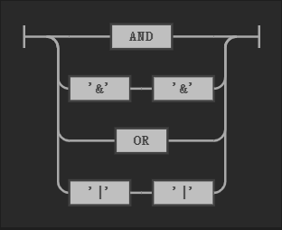
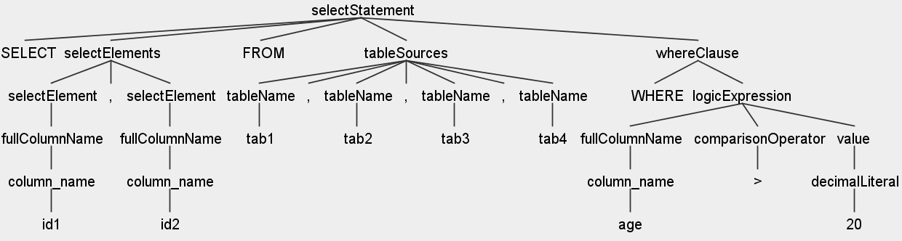

# 基于 ANTLR 的 SQL 词法/语法分析

## 实验目的及要求

+ 利用 ANTLR ，对 SQL 中的查询语句进行词法/语法分析，包括 SELECT、FROM、WHERE 等短语
+ 词法语法分析结果用一棵树存储并输出
+ 支持的表格个数 > 4

## 实验环境 

+ 设备：PC
+ 操作系统：Windows 10
+ 开发工具: VSCode
+ 语言环境：Java (JDK 8)
+ 依赖：ANTLR v4.8

## 实验内容

ANTLR 是一个开源的语言解析工具，为包括 Java，C++，C# 在内的语言提供了一个通过语法描述来自动构造自定义语言的识别器（Recognizer），编译器（Parser）和解释器（Translator）的框架。与 Lex 和 Yacc 类似，通过定义适当的词法与语法规则，生成相应程序，解析输入语句，生成对应的语法树。

具体而言，ANTLR 分为以下几个部分：

+ 词法分析器（Lexer）：

  词法分析器的工作是分析量化那些本来毫无意义的字符流，将他们翻译成离散的字符组（也就是一个一个的 Token），包括关键字，标识符，符号（symbols）和操作符供语法分析器使用。

+ 语法分析器（Parser）：

  编译器又称为 Syntactical analyser。在分析字符流的时候，Lexer 不关心所生成的单个 Token 的语法意义及其与上下文之间的关系，而这就是 Parser 的工作。语法分析器将收到的 Tokens 组织起来，并转换成为目标语言语法定义所允许的序列。

  无论是 Lexer 还是 Parser 都是一种识别器，Lexer 是字符序列识别器而 Parser 是 Token 序列识别器。他们在本质上是类似的东西，只是在分工上有所不同。

+ 树分析器（Tree parser）：
  树分析器可以用于对语法分析生成的抽象语法树进行遍历，并能执行一些相关的操作。

+ ANTLR：
  ANTLR 将上述结合起来，它允许我们定义识别字符流的词法规则和用于解释 Token 流的语法分析规则。然后，ANTLR 将根据用户提供的语法文件自动生成相应的词法/语法分析器。用户可以利用他们将输入的文本进行编译，并转换成其他形式（如 AST—Abstract Syntax Tree，抽象的语法树）。

本次实验将采用 Java 版的 ANTLR，对 SQL 语句中常见的查询类语句（SELECT）进行词法与语法分析。ANTLR 的词法和语法规则，统一写在名为 sqlQuery.g4 的文件中。

## 实验步骤

#### 环境配置

首先需要配置 Java 与 ANTLR 的运行环境。

Java 的安装与配置不必赘述，重点在 ANTLR 上。

+ ANTLR 下载地址：https://www.antlr.org/download/。下载最新版本的 jar 包（antlr-4.8-complete.jar）。

+ 将下载好的 jar 包添加到系统环境变量 CLASSPATH 之中（我的路径 D:\ToolKit\JAVA\ANTLR\antlr-4.8-complete.jar）。

+ 创建 antlr4.bat 和 grun.bat 文件

  antlr4.bat:

  ```bat
  java org.antlr.v4.Tool %*
  ```

  grun.bat:

  ```bat
  java org.antlr.v4.gui.TestRig %*
  ```

  同样的，将这两个文件所在的文件夹添加到环境变量 PATH 中（我的路径 D:\ToolKit\JAVA\ANTLR）。

  antlr4.bat 的作用，是将写好的词法/语法文件，转换为相应 JAVA 程序，而 grun.bat 则是运行并测试其中语法，生成可视化语法树。

  配置好环境变量后，cmd 打开命令行窗口，分别输入 antrl4 和 grun，查看是否配置成功。

#### 词法分析

词法分析的重点，在于使用正则表达式，区分关键词及用户输入的变量、常量名，并为其打上 token，同时 SQL 语句的关键字并不严格区分大小写，因此也需要将大小写字母整合起来。

在这里节选部分代码进行展示：

```java
// 定义一些标签，英文字母不区分大小写
fragment A: [aA];
fragment B: [bB];
fragment C: [cC];
fragment D: [dD];
fragment E: [eE];
fragment F: [fF];
```

```java
// 关键字
AS: A S;
SELECT: S E L E C T;
FROM: F R O M;
TABLE: T A B L E;
MAX: M A X;
```

```java
// 表格内容的合法名称
ID: ('A' ..'Z' | 'a' ..'z' | '_' | '$') (
		'A' ..'Z'
		| 'a' ..'z'
		| '_'
		| '$'
		| '0' ..'9'
	)*;
```

#### 语法分析

语法分析需要对 SQL 查询语句的语法结构进行抽象，分块，构建不同模块的语法规则。同样的，节选部分代码进行说明。

```sql
selectStatement:
	SELECT selectElements (
		FROM tableSources (whereClause)? (groupByCaluse)? (
			havingCaluse
		)?
	)? (orderByClause)? (limitClause)?;
```

上面代码表示查询语句总体的语法结构，命名为 selectStatement。可以看到，SELECT 和 FROM 关键字是固定不变的，而其中诸如 selectElements（查询内容），tableSources（表名）等也有各自的语法结构，将会在后面定义。而诸如 whereClause，orderByClause 等标记的后面带有一个问号 “ ? ”，这表示该结构是可选项，即查询语句 SELECT  FROM 后的 WHERE 和 ORDER 不是必须的。 

此外，SQL 语句还具有运算部分：

```sql
logicalOperator: AND | '&' '&' | OR | '|' '|';

comparisonOperator:
	'='
	| '>'
	| '<'
	| '<' '='
	| '>' '='
	| '<' '>'
	| '!' '='
	| '<' '=' '>';
```

logicalOperator 概括逻辑运算，comparisonOperator 概括比较运算。



这张图由 VSCode 的插件 ANTLR4 grammar syntax support 生成。表示 logicalOperator 的逻辑通路，表明在构建语法树时，只有四种情况的 token 组合可以通过这条路径，生成一颗子树。其他的语法结构也是如法炮制。

#### 文件编译

将所有的词法及语法规则，写入到后缀名为 .g4 的文件中，在我的电脑上，命名为 sqlQuery.g4。

打开 cmd 窗口，进入 sqlQuery.g4 所在文件夹，执行如下命令，生成相关 java 文件与 token 文件：

```shell
antlr4 sqlQuery.g4
```

继续输入命令，编译生成的 java 文件即可

```shell
javac ./*.java
```

## 测试分析

实验基本目标为：至少能解析 SELECT、FROM、WHERE 短语，并支持 4 个表以上。

下列 SQL 语句满足该目标，以该语句为测试用例，详细说明测试流程：

```sql
-- test0
SELECT id1,id2 FROM tab1,tab2,tab3,tab4 WHERE age > 20 
```

打开 cmd 窗口进行，进入 sqlQuery.g4 所在文件夹，执行如下命令：

```shell
grun sqlQuery selectStatement -gui
```

然后输入测试语句，回车，再按 Ctrl+z，回车，即可生成如下可视化语法树：



可以看到，3个关键词， 2 个 id ，4 个 tab，表达式及标点符号，全都被划分到了正确的子树中，满足了实验要求。

其他测试用例如下，都能成功解析。生成的语法树详见附件。

```sql
-- test1 基本查询
SELECT * FROM students
-- test2 条件查询
SELECT * FROM students WHERE score >= 80
-- test3 使用 AND 条件查询
SELECT * FROM students WHERE score >= 80 AND gender = 'M'
-- test4 使用 OR 条件查询
SELECT * FROM students WHERE score >= 80 OR gender = 'M'
-- test5 使用 NOT 条件查询
SELECT * FROM students WHERE NOT class_id = 2
-- test6 多条件查询
SELECT * FROM students WHERE (score < 80 OR score > 90) AND gender = 'M'
-- test7 投影查询
SELECT id, score, name FROM students
-- test8 使用投影查询，并将列名重命名
SELECT id, score points, name FROM students
-- test9 使用投影查询+WHERE条件
SELECT id, score points, name FROM students WHERE gender = 'M'
-- test10 按score从低到高
SELECT id, name, gender, score FROM students ORDER BY score
-- test11 按score从高到低
SELECT id, name, gender, score FROM students ORDER BY score DESC
-- test12 按score, gender排序
SELECT id, name, gender, score FROM students ORDER BY score DESC, gender
-- test13 带WHERE条件的ORDER BY
SELECT id, name, gender, score FROM students WHERE class_id = 1 ORDER BY score DESC
-- test14 分页查询
SELECT id, name, gender, score FROM students ORDER BY score DESC LIMIT 3 OFFSET 0
-- test15 聚合查询
SELECT COUNT(*) FROM students
-- test16 使用聚合查询求行数并设置结果集的列名为 num
SELECT COUNT(*) num FROM students
-- test17 使用聚合查询求平均值
SELECT AVG(score) average FROM students WHERE gender = 'M'

```

## 结论

本次实验通过使用 ANTLR ，设计了一些常见 SQL 查询语句的词法/语法分析模块。通过测试，证明该程序能够解析这些 SQL 查询语句，生成正确的语法树。当然，它也还有许多不足，比如还没有编写 JOIN 相关的语法解析，在以后的学习工作中可以尝试扩展。

